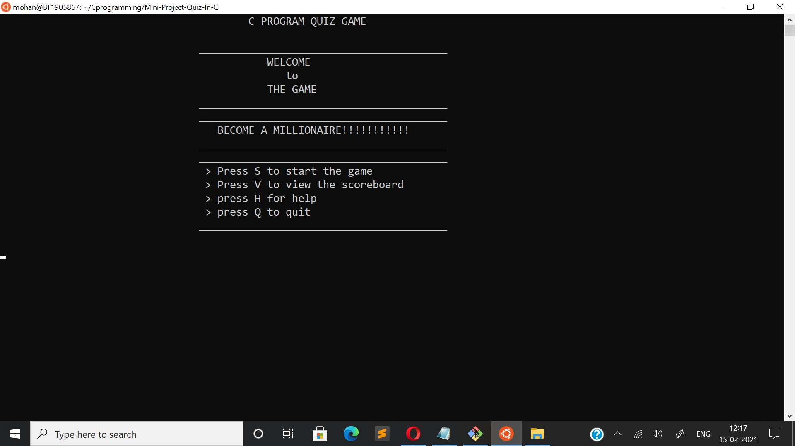
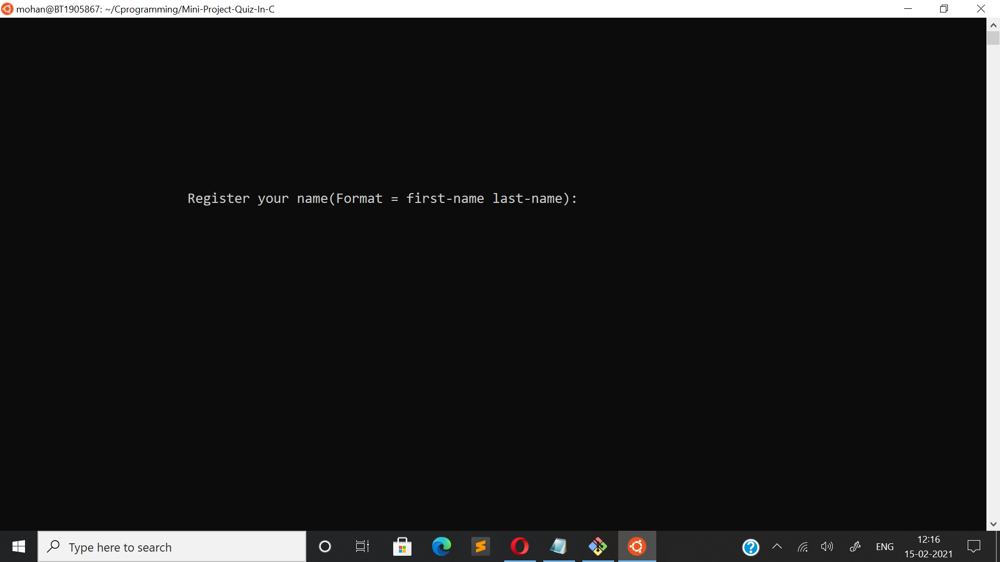
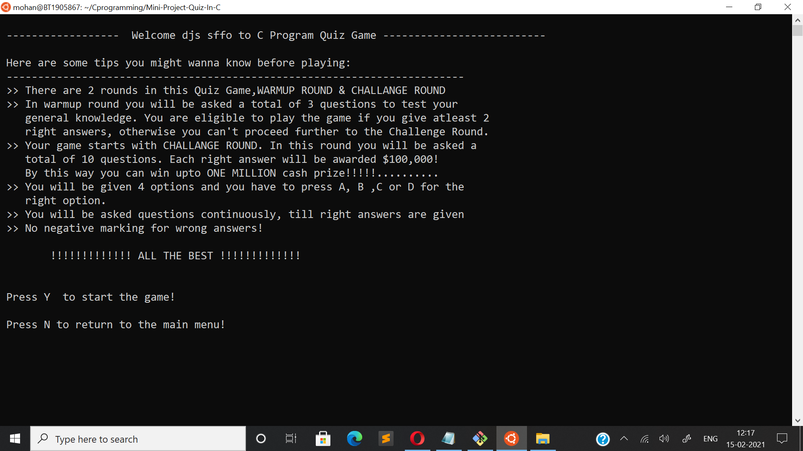
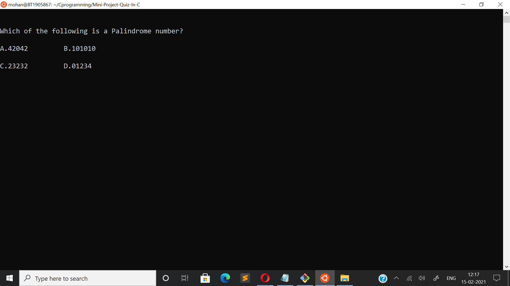
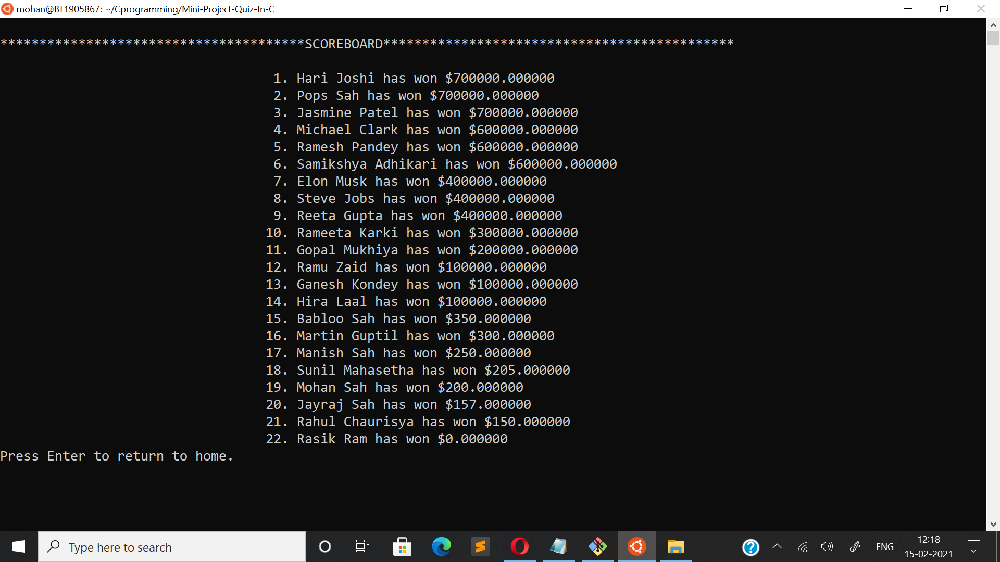
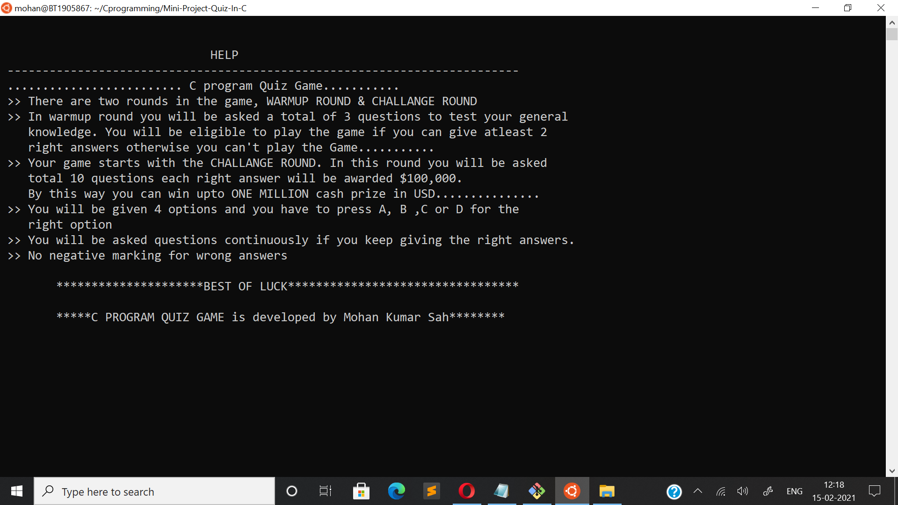

# An Introduction To Project
This is a flawless two-rounnd **QUIZ GAME,MINI-PROJECT In C** designed as simple console application in which a player is asked **three questions** in first round  and player has to get **at least two of them right** to be through to the next round.Of two rounds,the first round is called *Warm-UP round* and second round is called *Challenge  round*.Inorder to make second round more interesting , player is going to be asked continuously and awarded **$100,000!** for each correct answer given.The second round ends the moment player fails to answer correctly or when player's prize accrues upto $1million.There is no negative marking as a result of which player's money will not be deducted from accumulated money of him/her for wrong answer to question.

 ## Followings are User-defined functions defined to design QUIZ GAME:
1. **add_player() -** adds player's name along with his/her score to QuizRecord.txt file.
2. **sort_record() -** reads players' name along with their score from QuizRecord.txt, sort them in descendig order of their score(higher scorer of all time appears at the top) and writes them to a new file sorted_record.txt.
3. **show_record() -** reads players' name along with their score from sorted_record.txt and and write them to standard output console.
4. **help() -** help menu with game summary and rules.

## Output Screenshots

**NOTE:** *This source code is to be exclusively compiled in Linux based Operating System with gcc compiler.*

